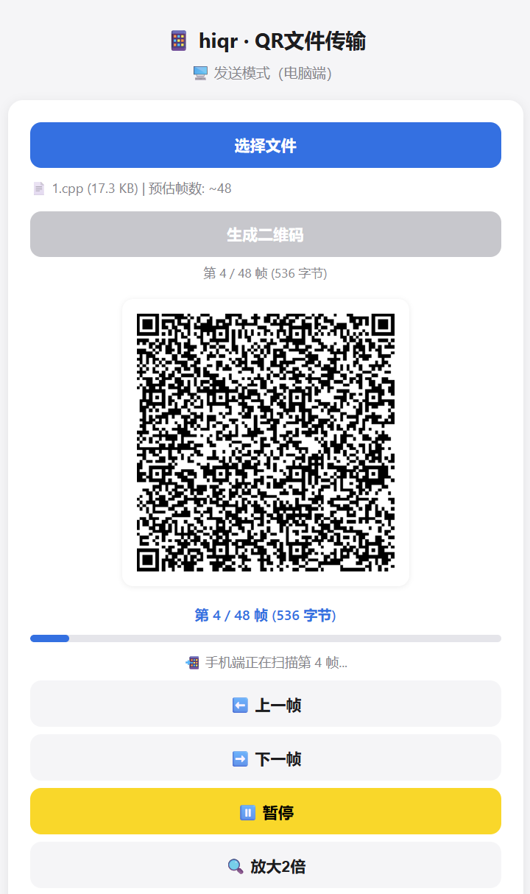
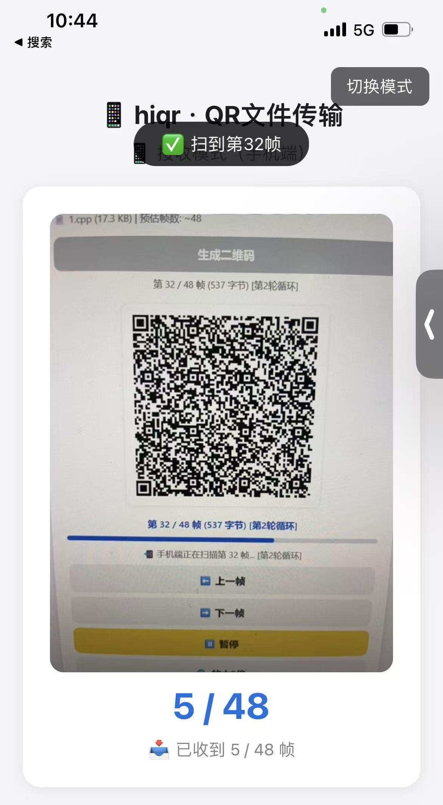

# hiqr

Transfer any files via a continuous QR code stream — **no dependencies, totally offline** on the send side!

中文文档 | **[English Version](README.md)**

## Table of Contents

- [Features](#features)
- [How It Works](#how-it-works)
- [Quick Start](#quick-start)
- [Usage](#usage)
  - [Send Mode (Desktop)](#send-mode-desktop)
  - [Receive Mode (Mobile)](#receive-mode-mobile)
- [Technical Details](#technical-details)
- [Acknowledgements](#acknowledgements)
- [License](#license)
- [Author](#author)
- [Support](#support)

---

## Features

- 📦 **Single HTML file** — zero install, zero server, zero network needed on the sender
- 🔄 **Continuous QR stream** — file is split into frames and displayed as an auto-playing QR animation
- 📱 **Auto-detects device** — opens in Send mode on desktop, Receive mode on mobile automatically
- 🔀 **Scan from any frame** — receiver can start mid-stream and still reassemble the complete file
- ✅ **CRC32 integrity check** — every transfer is verified before the file is offered for download
- 🖼️ **Inline preview** — images are shown immediately; text files appear in a preview box
- 📋 **Copy or Download** — received text can be copied to clipboard; all files can be saved
- ⏸️ **Pause / Manual navigation** — pause auto-play or step through frames one at a time
- 🔍 **2× Zoom** — enlarge the QR display for easier scanning at a distance

---

## How It Works

```
┌──────────────────────────────────┐            ┌──────────────────────────────────┐
│         PC / Desktop             │            │         Mobile Phone              │
│                                  │  ───────►  │                                  │
│  File → Base64 → 500 B chunks    │  QR codes  │  Camera → jsQR → Reassemble      │
│  QR stream, 1 frame / 1.2 s      │            │  CRC32 verify → Preview/Download  │
└──────────────────────────────────┘            └──────────────────────────────────┘
```

1. **Sender (desktop):** The file is read, Base64-encoded, and split into ~500-byte chunks. Each chunk is wrapped in a small JSON frame that carries the filename, total frame count, frame index, and a CRC32 checksum. Frames are rendered as QR codes (Version 38, Error Correction Level L) cycling every **1.2 seconds**, looping continuously.

2. **Receiver (mobile):** The camera decodes QR codes in real time using jsQR. Frames can arrive in any order — the app tracks received frames and assembles the file once all are collected. A CRC32 check confirms data integrity before preview or download.

---

## Quick Start

1. Open `hiqr.html` in a browser on your **PC** — no server needed, just double-click the file.
2. Open `hiqr.html` in the browser on your **phone** (via local share, USB, or any convenient method).
3. Follow the steps in [Usage](#usage) below.

> Use the **切换模式** button (top-right corner) to manually switch between Send and Receive mode on either device.

---

## Usage

### Send Mode (Desktop)

The page opens automatically in **Send Mode** on desktop browsers.

1. Click **选择文件 (Select File)** and pick any file. The estimated frame count is shown below the filename.
2. Click **生成二维码 (Generate QR)** — the QR stream starts playing immediately.
3. Hold your phone's camera up to the screen and begin scanning.



**Controls during transmission:**

| Button | Action |
|--------|--------|
| ⏸️ Pause / ▶️ Resume | Pause or resume auto-play |
| ⬅️ Prev frame | Step back one frame manually |
| ➡️ Next frame | Step forward one frame manually |
| 🔍 2× Zoom / Restore | Enlarge the QR code for easier scanning |

> The stream **loops automatically** from frame 1 after the last frame — the phone can pick up any missed frames on the next cycle.

---

### Receive Mode (Mobile)

The page opens automatically in **Receive Mode** on mobile browsers.

1. Tap **📷 启动摄像头扫描 (Start Camera)**.
2. Point the camera at the QR codes on the desktop screen.
3. The progress counter shows frames received so far (e.g., `12 / 35`).
4. Once all frames are collected, the file is verified and presented:
   - **Images** (jpg, png, gif, webp, svg, …) are displayed inline.
   - **Text files** (txt, md, json, csv, js, …) appear in a preview box with a **Copy** button.
   - **All files** can be saved with the **Download** button.



> You can start scanning from **any frame** — frame 1 is not required to be the first one scanned.

---

## Technical Details

| Parameter | Value |
|-----------|-------|
| QR Version | 38 |
| Error Correction Level | L (~2 634 bytes capacity per QR) |
| Raw chunk size | ~500 bytes |
| JSON-wrapped frame size | ~700 – 850 bytes |
| Frame interval | 1.2 seconds |
| Integrity check | CRC32 |
| QR encode library | qrcode.js (embedded) |
| QR decode library | jsQR (embedded) |
| External dependencies | **None** — fully self-contained single HTML file |

---

## Recent Updates

- Receive mode now includes a **Rescan** button to discard all scanned frames and restart scanning.
- Send mode keeps the Chrome-side two-row control layout and auto-starts QR playback after generation.

---

## Acknowledgements

hiqr embeds the following excellent open-source projects (all MIT-licensed), so it runs with zero external network access:

| Library | Purpose | Repository |
|---------|---------|------------|
| [qrcode.js](https://github.com/davidshimjs/qrcodejs) by davidshimjs | QR code generation (sender encoding) | github.com/davidshimjs/qrcodejs |
| [jsQR](https://github.com/cozmo/jsQR) by Cosmo Wolfe | QR code decoding (receiver camera scan) | github.com/cozmo/jsQR |

The following algorithms are implemented in pure JS by this project itself:

- **CRC32** (polynomial `0xEDB88320`, public-domain standard) — used for transfer integrity verification
- **inflateRawJS** (RFC 1951 deflate-raw) — used as a fallback decompressor on browsers (e.g. Safari) that don't support `DecompressionStream('deflate-raw')`

---

## License

[MIT](LICENSE)

---

## Author

**Jidor Tang**
✉️ [tlqtangok@126.com](mailto:tlqtangok@126.com)
🐙 [github.com/tlqtangok](https://github.com/tlqtangok)

---

## Support

If you find hiqr useful, feel free to buy me a coffee ☕


*WeChat Reward Code*
